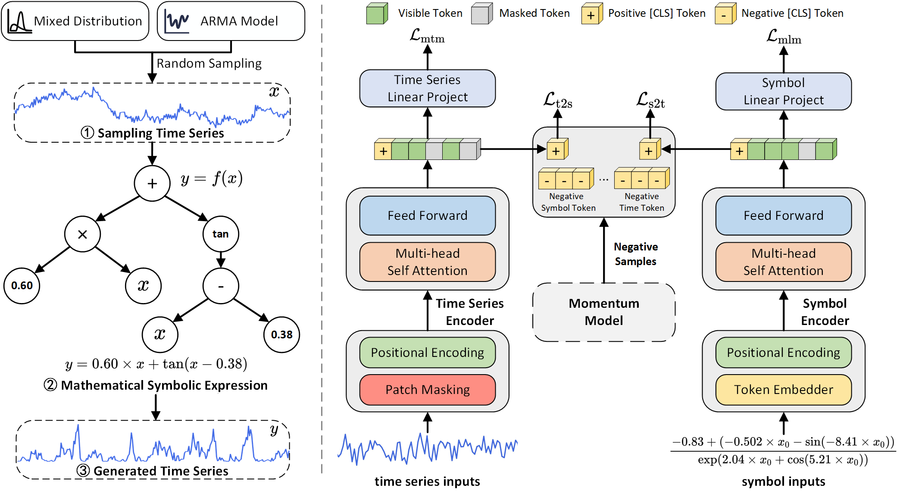
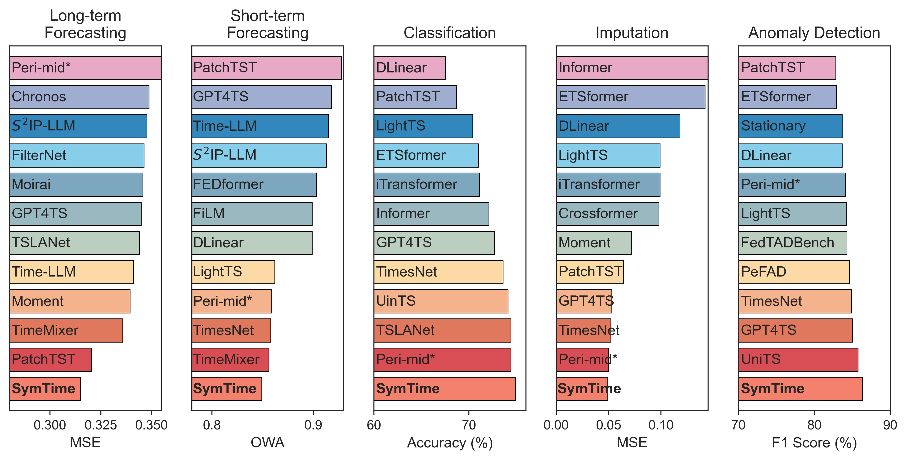

#  SymTime NeurIPS 2025 

This code is the official PyTorch implementation of our NeurIPS'25 paper: **Synthetic Series-Symbol Data Generation for Time Series Foundation Models**.

<div align="center">

[]() [](https://pypi.org/project/s2generator/) [](https://www.python.org/) [](https://pytorch.org/)

[Paper]() | [Quickstart](#Quickstart) | [Poster]() | [Blog]() | [Citation](#Citation)

</div>

## Introduction

Due to issues such as data privacy and acquisition difficulties, existing large-scale time series datasets face severe data shortages and imbalanced distribution compared to images and natural language. Foundation models pre-trained on these datasets will have certain prediction biases, reducing their generalization and robustness.

Inspired by complex dynamic system theories, we design a [series-symbol](https://github.com/wwhenxuan/S2Generator) data generation mechanism, enabling the unrestricted creation of high-quality time series data paired with corresponding symbolic expressions. To leverage series-symbol data pairs with strong correlations, we develop **SymTime**, a pre-trained foundation model for enhancing time series representation using symbolic information, which demonstrates competitive performance across five major TSA tasks, rivaling foundation models pre-trained on real-world datasets.

<div style="text-align: center;">
    
</div>

## Quickstart

### Installation

First create a Python virtual environment (preferably version 3.10.15), then install the required dependencies by running the following command:

```
pip install -r requirements.txt
```

### Data preparation


Prepare Data. You can obtained the well pre-processed datasets from [OneDrive](https://1drv.ms/u/c/801ce36c4ff3f93b/EVTDLHyvegpEn_Oxa6ZiuFIBjTsKk6m9JldUqWDqvrVCnQ?e=P2T3Vc) or [BaiduCloud](https://pan.baidu.com/s/1W7UoAWKZjoukSZ74FTipYA?pwd=2255). (This may take some time, please wait patiently.) Then place the downloaded data under the folder `./dataset`. 

### Train and evaluate model

- To see the model structure of CATCH,  [click here](./ts_benchmark/baselines/catch/CATCH.py).
- We provide the experiment scripts for CATCH and other baselines under the folder `./scripts/multivariate_detection`. For example you can reproduce a experiment result as the following:

```shell
sh ./scripts/multivariate_detection/detect_label/MSL_script/CATCH.sh

sh ./scripts/multivariate_detection/detect_score/MSL_script/CATCH.sh
```


## Results

### Main Results


### Benchmark Results

Extensive experiments on 10 real-world datasets and 12 synthetic datasets demonstrate that CATCH achieves state-of-the-art performance. We show the main results of all the 10 real-world datasets, and report the mean results of the 6 types of synthetic datasets:

<div style="text-align: center;">
    
</div>


### Dataset and Representation Learning


## Setup for Running Baseline Models
If you want to test all baseline models, please refer to the Time Series Anomaly Detection Benchmark [TAB](https://github.com/decisionintelligence/TAB):


## Citation

If you find this repo useful, please cite our paper.

```


```


## Contact


3.10.15