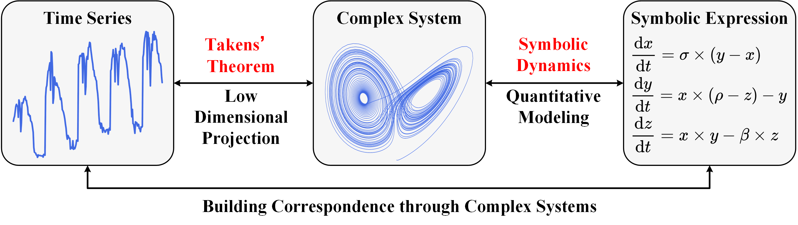
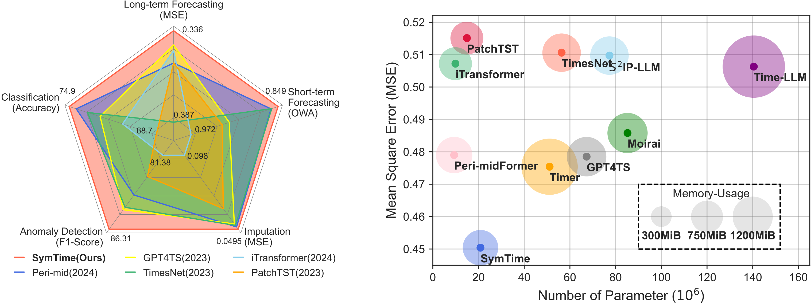
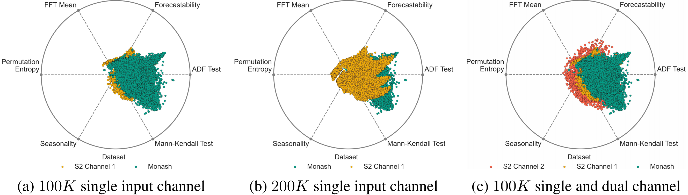
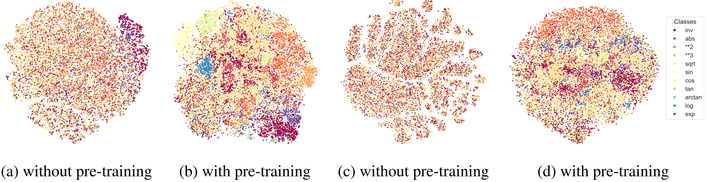

#  SymTime NeurIPS 2025 

This code is the official PyTorch implementation of our NeurIPS'25 paper: **Synthetic Series-Symbol Data Generation for Time Series Foundation Models**.

<div align="center">

[]() [](https://pypi.org/project/s2generator/) [](https://www.python.org/) [](https://pytorch.org/)

[Paper](https://arxiv.org/abs/2510.08445) | [Poster](https://github.com/wwhenxuan/wwhenxuan.github.io/blob/main/assets/img/poster_neurips_2025_115260_synthetic_series-symbol_data_generation.jpg) | [Blog]() | [Video]() | [Citation](#Citation)

</div>

## ✨ Introduction

Due to issues such as data privacy and acquisition difficulties, existing large-scale time series datasets face severe data shortages and imbalanced distribution compared to images and natural language. Foundation models pre-trained on these datasets will have certain prediction biases, reducing their generalization and robustness.

Inspired by complex dynamic system theories, we design a [series-symbol](https://github.com/wwhenxuan/S2Generator) data generation mechanism, enabling the unrestricted creation of high-quality time series data paired with corresponding symbolic expressions. To leverage series-symbol data pairs with strong correlations, we develop **SymTime**, a pre-trained foundation model for enhancing time series representation using symbolic information, which demonstrates competitive performance across five major TSA tasks, rivaling foundation models pre-trained on real-world datasets.

<div style="text-align: center;">
    
</div>

## 🧭 Quickstart

### Installation

First create a Python virtual environment (preferably version 3.10.15), then install the required dependencies by running the following command:

```
pip install -r requirements.txt
```

### Data Preparation 

SymTime relies on a large-scale series-symbol bimodal dataset generated by [`S2Generator`](https://github.com/wwhenxuan/S2Generator) during pre-training. You can generate the data required for pre-training by executing the following script:

```bash
bash ./scripts/s2generator.sh
```

For the fine-tuning datasets, you can load from [OneDrive](https://drive.google.com/drive/folders/1of5P-Cy-dve9zs09p_Gr_wHh8Z_hfRN_?usp=sharing) or [BaiduCloud](https://pan.baidu.com/s/1gj44jULMdtCBLC_BwRrqVA?pwd=6666). Then place the downloaded datasets under the folder `./datasets`.

### Model Pre-Train and Fine-Tune

Once you have generated enough time series data using [`S2Generator`](https://github.com/wwhenxuan/S2Generator), you can pre-train SymTime by executing our pre-training script:

```shell
bash ./scripts/SymTime_pretrain.sh
```

If you want to skip the time-consuming pre-training phase, you can directly download our pre-trained model parameters from [OneDrive](https://drive.google.com/drive/folders/1of5P-Cy-dve9zs09p_Gr_wHh8Z_hfRN_?usp=sharing) or [BaiduCloud](https://pan.baidu.com/s/1gj44jULMdtCBLC_BwRrqVA?pwd=6666) and put them under `./models/params/` for fine-tuning on downstream tasks:

```shell
# Long-term time series forecasting
bash ./scripts/long_term_forecasting/SymTime_ECL.sh

# Short-term time series forecasting
bash ./scripts/short_term_forecasting/SymTime_M4.sh

# Time series classification
bash ./scripts/classification/SymTime_EthanolConcentration.sh

# Time series imputation
bash ./scripts/imputation/SymTime_ECL.sh

# Time series anomaly detection
bash ./scripts/anomaly_detection/MSL.sh
```

## 📊 Results

### Main Results

Compared with other models for general time series analysis tasks, **SymTime**, which has been pre-trained with mask modeling and cross-modal contrastive learning, can achieve SOTA results in fine-tuning of downstream tasks and has lower model complexity.

<div style="text-align: center;">
    
</div>

### Benchmark Results

We present the experimental results on the `TimesNet` benchmark. Compared with the current more advanced models, **SymTime** can achieve better experimental results.

<div style="text-align: center;">
    
</div>

### Dataset and Representation Learning

We generate a large amount of series-symbol bimodal data using [`S2Generator`](https://github.com/wwhenxuan/S2Generator) for pre-training of mask modeling and contrastive learning. Therefore, we first verify the representation coverage of the synthetic data compared with real-world time series dataset.

<div style="text-align: center;">
    
</div>

Then, we visualize the representation space of time series encoder (a)(b) and symbolic expression encoder (c)(d) in **SymTime** before and after pre-training. The paired time series and symbolic expressions form distinct clustering features, demonstrating the effectiveness of our pre-training paradigm.

<div style="text-align: center;">
    
</div>


## 🎓 Citation <a id="Citation"></a>

If you find this code useful, please cite our paper.

```
@misc{wang2025syntheticseriessymboldatageneration,
      title={Synthetic Series-Symbol Data Generation for Time Series Foundation Models}, 
      author={Wenxuan Wang and Kai Wu and Yujian Betterest Li and Dan Wang and Xiaoyu Zhang},
      year={2025},
      eprint={2510.08445},
      archivePrefix={arXiv},
      primaryClass={cs.LG},
      url={https://arxiv.org/abs/2510.08445}, 
}
```

## 🎖️ Acknowledgement

We appreciate the following GitHub repos a lot for their valuable code and efforts.

- Time-Series-Library (https://github.com/thuml/Time-Series-Library);
- PySDKit (https://github.com/wwhenxuan/PySDKit);
- ALBEF (https://github.com/salesforce/ALBEF);
- PatchTST (https://github.com/yuqinie98/PatchTST);
- Short-term Forecasting: https://github.com/ServiceNow/N-BEATS.

## 🤗 Contact

If you have any questions or are interested in our view on the complex dynamics of time series, feel free to contact:

- [Whenxuan Wang](https://wwhenxuan.github.io/) (whenxuanwang@stu.xidian.edu.cn)
- [Kai Wu](https://sparsel.github.io/index.html) (kwu@xidian.edu.cn)
- [Dan Wang](https://web.xidian.edu.cn/danwang/) (danwang@xidian.edu.cn)
